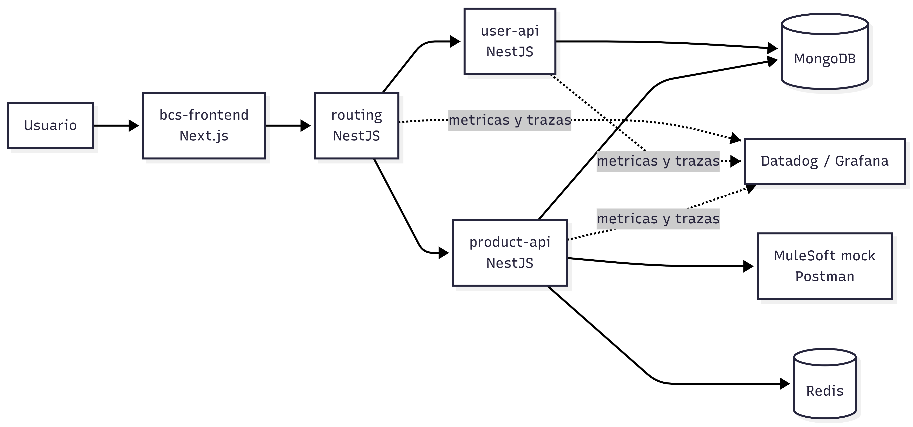

# bcs-backing

Monorepo que agrupa multiples aplicaciones para la plataforma BCS: un frontend en Next.js y varios servicios backend en NestJS. El proyecto trabaja con una arquitectura basada en microservicios y enfoque hexagonal, con integraciones sobre MongoDB, Redis y observabilidad con Datadog/OpenTelemetry.

## Implementar el proyecto con Docker Compose

Para construir y ejecutar todos los servicios definidos en [`docker-compose.yml`](/C:/Jorge/Dev/bcs/bcs-backing/docker-compose.yml), usa:

```bash
docker compose up --build -d
```
## Servicios y puertos

- `bcs-frontend`: `http://localhost:3000`
- `routing`: `http://localhost:3001`
- `user-api`: `http://localhost:3002`
- `product-api`: `http://localhost:3003`
- `MongoDB`: `localhost:27017`
- `Redis`: `localhost:6379`
- `Datadog Agent`: puertos `8125/udp` y `8126/tcp`

## Requisitos previos

- Tener Docker y Docker Compose instalados.

Detener el entorno:

```bash
docker compose down
```

## Arquitectura



Flujo principal de comunicacion:

- El usuario consume la interfaz web en `bcs-frontend`.
- El frontend se comunica con `routing`.
- `routing` centraliza las llamadas hacia `user-api` y `product-api`.
- `routing` puede consumir servicios externos expuestos por `MuleSoft` mediante un mock para ambientes de desarrollo o pruebas.
- `user-api` y `product-api` persisten informacion en `MongoDB`.
- `product-api` usa `Redis` como apoyo para cache.
- Los servicios backend envian telemetria a `Datadog`.

## Aplicaciones

- `bcs-frontend`: aplicacion web construida con Next.js.
- `routing`: servicio NestJS que centraliza el enrutamiento y la comunicacion entre APIs.
- `user-api`: microservicio NestJS para la gestion de usuarios con persistencia en MongoDB.
- `product-api`: microservicio NestJS para la gestion de productos con MongoDB y Redis.

## Tecnologias principales

- `Next.js` y React para el frontend.
- `NestJS` y TypeScript para los servicios backend.
- `MongoDB` como base de datos principal.
- `Redis` para cache y soporte de alto rendimiento.
- `Postman / MuleSoft` como integracion externa simulada mediante mock para pruebas de consumo.
- `Datadog` y `OpenTelemetry` para trazabilidad y monitoreo.
- `Arquitectura hexagonal` para separar dominio, aplicacion e infraestructura.


