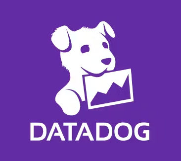
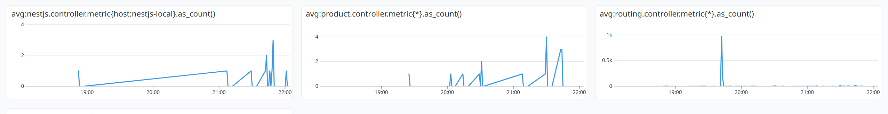
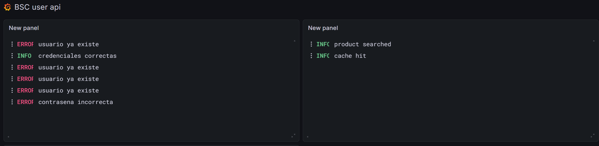

# bcs-backing

Monorepo que agrupa multiples aplicaciones para la plataforma BCS: un frontend en Next.js y varios servicios backend en NestJS. El proyecto trabaja con una arquitectura basada en microservicios y enfoque hexagonal, con integraciones sobre MongoDB, Redis y observabilidad con Datadog/OpenTelemetry.

## Implementar el proyecto con Docker Compose

Para construir y ejecutar todos los servicios definidos en [`docker-compose.yml`](/C:/Jorge/Dev/bcs/bcs-backing/docker-compose.yml), usa:

```bash
docker compose up --build -d
```
## Servicios y puertos

- `bcs-frontend`: `http://localhost:3000`
- `routing`: `http://localhost:3001`
- `user-api`: `http://localhost:3002`
- `product-api`: `http://localhost:3003`
- `MongoDB`: `localhost:27017`
- `Redis`: `localhost:6379`
- `Datadog Agent`: puertos `8125/udp` y `8126/tcp`

## Requisitos previos

- Tener Docker y Docker Compose instalados.

Detener el entorno:

```bash
docker compose down
```

## Arquitectura


Flujo principal de comunicacion:

- El usuario consume la interfaz web en `bcs-frontend`.
- El frontend se comunica con `routing`.
- `routing` centraliza las llamadas hacia `user-api` y `product-api`.
- `user-api` y `product-api` persisten informacion en `MongoDB`.
- `product-api` usa `Redis` como apoyo para cache.
- `product-api` puede consumir servicios externos expuestos por `MuleSoft` para temas de prueba consume un mock de `Postman`.
- Los servicios backend envian metricas a `Datadog Agent` y exportan logs mediante `OpenTelemetry` hacia `Grafana`.

## Aplicaciones

- `bcs-frontend`: aplicacion web construida con Next.js.
- `routing`: servicio NestJS que centraliza el enrutamiento y la comunicacion entre APIs.
- `user-api`: microservicio NestJS para la gestion de usuarios con persistencia en MongoDB.
- `product-api`: microservicio NestJS para la gestion de productos con MongoDB y Redis.

## Tecnologias principales

- `Next.js` y React para el frontend.
- `NestJS` y TypeScript para los servicios backend.
- `MongoDB` como base de datos principal.
- `Redis` para cache y soporte de alto rendimiento.
- `Postman / MuleSoft` como integracion externa simulada mediante mock para pruebas de consumo.
- `Datadog`, `Grafana` y `OpenTelemetry` para trazabilidad, logs y monitoreo.
- `Arquitectura hexagonal` para separar dominio, aplicacion e infraestructura.


## Observabilidad

La implementacion actual de observabilidad esta presente en `routing`, `user-api` y `product-api`.

- Cada servicio inicia `OpenTelemetry` desde `main.ts` importando `./commons/tracing`.
  -- El host de metricas se resuelve con la variable de entorno `DD_AGENT_HOST`, que en Docker Compose apunta a `datadog-agent`.

Servicios validados:

- `routing`: prefijo de metricas `routing.` en [routing/src/commons/metrics.service.ts](/C:/Jorge/Dev/bcs/bcs-backing/routing/src/commons/metrics.service.ts) y bootstrap de OpenTelemetry en [routing/src/main.ts](/C:/Jorge/Dev/bcs/bcs-backing/routing/src/main.ts).
- `user-api`: prefijo de metricas `nestjs.` en [user-api/src/commons/metrics.service.ts](/C:/Jorge/Dev/bcs/bcs-backing/user-api/src/commons/metrics.service.ts) y bootstrap de OpenTelemetry en [user-api/src/main.ts](/C:/Jorge/Dev/bcs/bcs-backing/user-api/src/main.ts).
- `product-api`: prefijo de metricas `product.` en [product-api/src/commons/metrics.service.ts](/C:/Jorge/Dev/bcs/bcs-backing/product-api/src/commons/metrics.service.ts) y bootstrap de OpenTelemetry en [product-api/src/main.ts](/C:/Jorge/Dev/bcs/bcs-backing/product-api/src/main.ts).

##  DataDog




DATADOG LINK: https://p.datadoghq.com/sb/i414et4xdvq0gunm-734381b95c91cab1a5340eff1da78fd6

##  Grafana


GRAFANA LINK: https://corpjorge.grafana.net/public-dashboards/4e6d0c00f7cb4fa2b6f8698946542158

## QA

El proyecto incluye una estrategia de QA basada en pruebas unitarias y pruebas end-to-end para validar la logica de negocio, los controladores y la integracion entre servicios.

- `routing`: cuenta con `unit tests` y pruebas `e2e`.
- `user-api`: cuenta con `unit tests` y pruebas `e2e`.
- `product-api`: cuenta con `unit tests` y pruebas `e2e`.
- Bajo enfoque `ISTQB`, la estrategia aplica a todas las apps del proyecto con pruebas funcionales y no funcionales, cubriendo niveles `unit`, `integration`, `system` y `acceptance` segun el flujo evaluado.
- A nivel practico, esto se traduce en validar funcionalidades esperadas, integracion entre componentes, comportamiento del sistema completo y criterios de aceptacion para `bcs-frontend`, `routing`, `user-api` y `product-api`.
- Tambien se consideran tecnicas de caja negra, caja blanca y pruebas orientadas al riesgo, con foco en smoke testing, sanity testing, regression testing y exploratory testing sobre flujos criticos.
- La trazabilidad de incidentes y evidencias de ejecucion puede complementarse con `Datadog` y `Grafana`, facilitando analisis de defectos, monitoreo y seguimiento posterior a pruebas.
- Despues de ejecutar pruebas funcionales, se pueden revisar metricas, logs y trazabilidad en `Datadog` y `Grafana`.
