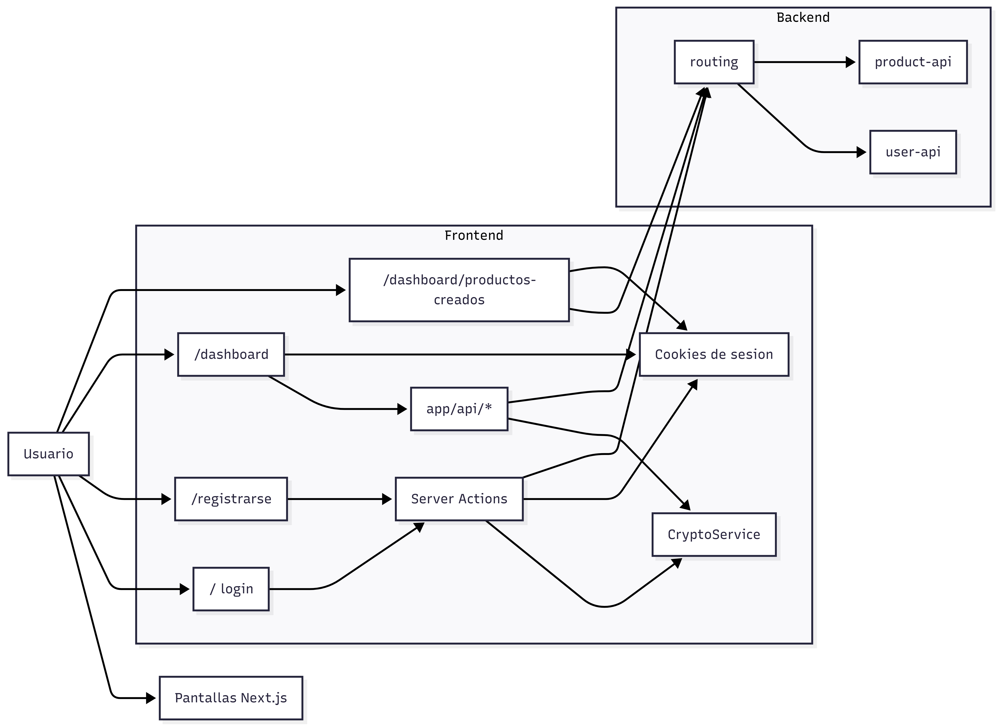

# bcs-frontend

Aplicacion web construida con `Next.js`, `React` y `Tailwind CSS` para la experiencia de usuarios de la plataforma BCS. Este frontend permite registrar usuarios, iniciar sesion, consultar productos disponibles, solicitar productos y revisar productos ya creados, consumiendo el gateway `routing` como punto de entrada hacia los servicios backend.

## Que hace este proyecto

- Muestra la pantalla de login para autenticacion de usuarios.
- Permite registrar nuevos usuarios.
- Consulta productos disponibles para el usuario autenticado.
- Permite solicitar productos financieros.
- Permite consultar productos ya registrados.
- Gestiona la sesion con cookies `httpOnly`.
- Consume el backend a traves de `routing`.

## Arquitectura

El proyecto usa `Next.js App Router` y organiza su funcionalidad en:

- `app/`: rutas, paginas, server actions y endpoints internos.
- `components/`: componentes de interfaz para login, registro, dashboard y consulta de productos.
- `app/actions/`: acciones del servidor para autenticacion y sesion.
- `app/api/`: endpoints internos para centralizar llamadas al backend desde el frontend.

Pantallas principales:

- `/`: login.
- `/registrarse`: registro de usuario.
- `/dashboard`: consulta de productos disponibles.
- `/dashboard/productos-creados`: consulta de productos registrados.

## Diagrama de arquitectura



## Flujo funcional

### Login

- La pantalla principal usa `login-screen`.
- La accion `app/actions/auth.ts` envia credenciales al endpoint `routing /auth/login`.
- La peticion se cifra antes del envio.
- Si el login es exitoso, se almacenan cookies de sesion:
  - `session_token`
  - `session_document_type`
  - `session_document_number`

### Registro

- La pantalla `/registrarse` permite crear nuevos usuarios.
- La accion `app/registrarse/actions.ts` envia la informacion cifrada a `routing /users-api/v1/registration`.

### Dashboard

- La pagina `/dashboard` consulta productos disponibles mediante `app/api/products/route.ts`.
- El frontend toma el usuario desde cookies y consulta `routing /products/v1/products`.

### Productos creados

- La pagina `/dashboard/productos-creados` consulta `routing /products/v1/read`.
- Esta operacion usa el `JWT` almacenado en la cookie `session_token`.

### Solicitud de producto

- `app/api/product-registration/route.ts` registra productos en `routing /products/v1/registration`.
- El payload se construye con el usuario autenticado y se cifra antes del envio.

## Integracion con backend

El frontend no consume directamente `user-api` ni `product-api`. Toda la comunicacion se realiza contra la variable de entorno `BACKENDAPI`, que apunta al servicio `routing`.

Ejemplos de integracion:

- Login: `POST /auth/login`
- Registro de usuario: `POST /users-api/v1/registration`
- Consulta de productos: `GET /products/v1/products`
- Registro de producto: `POST /products/v1/registration`
- Consulta de productos creados: `GET /products/v1/read`

## Seguridad

- La sesion se mantiene con cookies `httpOnly`.
- El frontend cifra payloads antes de enviarlos al gateway.
- El frontend tambien puede descifrar respuestas cifradas del backend.
- El acceso a productos creados requiere token `JWT`.
- Las paginas protegidas redirigen al login cuando no existe sesion valida.

## Estructura del codigo

```text
app/
  actions/
  api/
    product-registration/
    products/
  dashboard/
    productos-creados/
  registrarse/
  layout.tsx
  page.tsx
components/
  auth-shell.tsx
  dashboard-screen.tsx
  login-screen.tsx
  register-screen.tsx
  requested-products-screen.tsx
```

## Tecnologias principales

- `Next.js 16`
- `React 19`
- `TypeScript`
- `Tailwind CSS`
- `App Router`
- `Server Actions`

## Ejecucion

Instalar dependencias:

```bash
npm install
```

Levantar en desarrollo:

```bash
npm run dev
```

Compilar:

```bash
npm run build
```

Ejecutar en produccion:

```bash
npm run start
```

## Validaciones

- `npm run lint`: validacion de codigo del frontend.

## Variables de entorno

- `BACKENDAPI`: URL base del gateway `routing`.

## Observaciones

- El frontend utiliza rutas internas de `Next.js` para encapsular llamadas al backend.
- Parte del flujo de integracion reutiliza un `CryptoService` compatible con el esquema de cifrado del gateway.
- La interfaz esta orientada a un flujo de banca digital con autenticacion, consulta y solicitud de productos.
