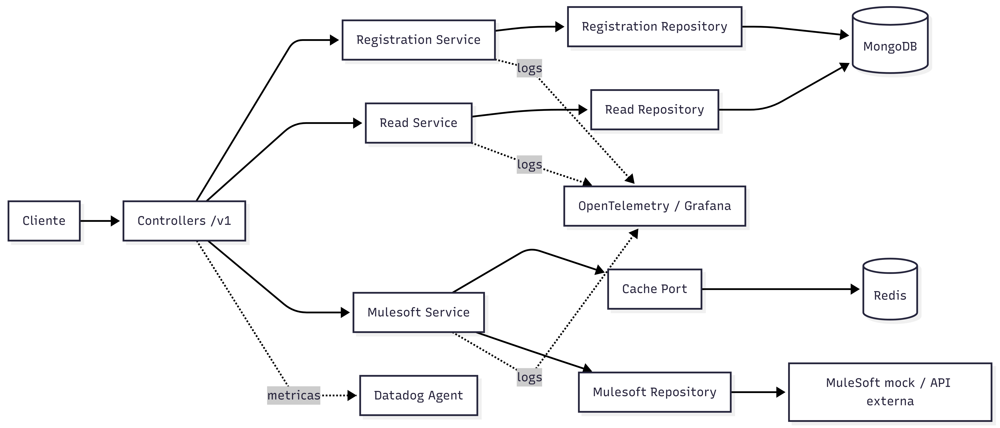

# product-api

Microservicio construido con `NestJS` para la gestion de productos de la plataforma. Se encarga de registrar productos por usuario, consultar productos almacenados y consumir una fuente externa tipo `MuleSoft` usando `Redis` como cache para optimizar lecturas.

## Que hace este proyecto

- Registra productos financieros asociados a un usuario.
- Consulta productos persistidos en `MongoDB`.
- Consume un origen externo de productos mediante un mock de `MuleSoft`.
- Usa `Redis` para cachear respuestas del flujo externo.
- Expone metricas con `Datadog` y logs con `OpenTelemetry`.

## Arquitectura

El proyecto sigue una arquitectura hexagonal por modulo, separando:

- `application`: casos de uso y servicios de negocio.
- `domain`: modelos y puertos.
- `infrastructure`: controladores, repositorios y esquemas.
- `commons`: componentes transversales como metricas y tracing.

Modulos principales:

- `registration`: registra productos en `MongoDB`.
- `read`: consulta productos por usuario desde `MongoDB`.
- `mulesoft`: consume productos desde un servicio externo y cachea en `Redis`.

## Diagrama de arquitectura



## Endpoints principales

### `POST /v1/registration`

Registra un producto para un usuario.

Ejemplo de payload:

```json
{
  "productType": "CDT",
  "user": "CC123456",
  "amount": 10000000,
  "term": 12
}
```

Tipos de producto soportados:

- `CDT`
- `MORTGAGE`
- `CREDIT_CARD`
- `SAVINGS_ACCOUNT`
- `PERSONAL_LOAN`

### `GET /v1/read?user=CC123456`

Consulta los productos registrados para un usuario.

### `GET /v1/products?user=CC123456`

Consulta productos desde la integracion externa tipo `MuleSoft`. El servicio intenta responder primero desde `Redis`; si no existe informacion en cache, consume la fuente externa y guarda el resultado.

## Persistencia e integraciones

- `MongoDB`: persistencia principal para registro y consulta de productos.
- `Redis`: cache para el modulo `mulesoft`.
- `MuleSoft mock`: origen externo consumido por `product-api`.
- `Datadog`: metricas via `hot-shots`.
- `Grafana / OpenTelemetry`: exportacion de logs y telemetria.

## Estructura del codigo

```text
src/
  api/
    registration/
    read/
    mulesoft/
  commons/
    metrics.module.ts
    metrics.service.ts
    tracing.ts
  app.module.ts
  main.ts
```

## Ejecucion

Instalar dependencias:

```bash
npm install
```

Levantar en desarrollo:

```bash
npm run start:dev
```

Compilar:

```bash
npm run build
```

## Testing

- `npm test`: pruebas unitarias.
- `npm run test:e2e`: pruebas end-to-end.
- `npm run test:cov`: cobertura.

## Observabilidad

El servicio inicializa `OpenTelemetry` desde `src/main.ts` e importa `src/commons/tracing.ts`. Adicionalmente, publica metricas por `StatsD` usando `DD_AGENT_HOST` como destino para el agente de `Datadog`.
