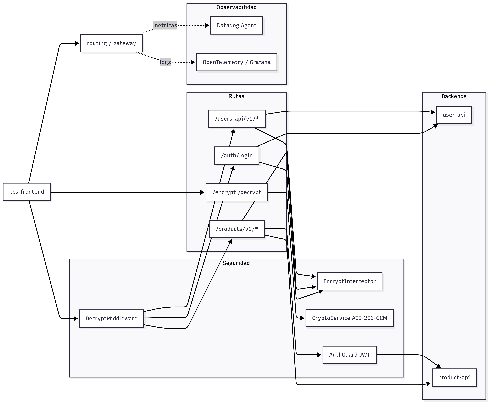

# routing

Servicio construido con `NestJS` que funciona como gateway entre `bcs-frontend` y los microservicios backend. Su responsabilidad principal es centralizar el acceso a `user-api` y `product-api`, aplicar cifrado y descifrado de payloads, exponer endpoints unificados y proteger operaciones sensibles mediante autenticacion con `JWT`.

## Que hace este proyecto

- Recibe solicitudes del frontend y las enruta hacia `user-api` y `product-api`.
- Desencripta automaticamente los cuerpos de entrada antes de procesarlos.
- Encripta automaticamente las respuestas de salida.
- Expone endpoints para `encrypt` y `decrypt`.
- Genera tokens `JWT` para proteger rutas sensibles.
- Publica metricas en `Datadog` y logs en `OpenTelemetry`.

## Rol dentro de la plataforma

`routing` es la capa que conecta el frontend con los backends. En lugar de que `bcs-frontend` consuma directamente `user-api` o `product-api`, las solicitudes pasan por este servicio para aplicar reglas comunes de seguridad, cifrado, autenticacion y trazabilidad.

## Arquitectura

El proyecto esta organizado en modulos funcionales:

- `routes/user-api`: proxy hacia `user-api`.
- `routes/products`: proxy hacia `product-api`.
- `routes/encrypt`: endpoints auxiliares para cifrar y descifrar payloads.
- `auth`: autenticacion y generacion de `JWT`.
- `commons`: cifrado, middleware de descifrado, interceptor de cifrado, metricas y tracing.

## Diagrama de arquitectura



## Seguridad y cifrado

El gateway utiliza `AES-256-GCM` para cifrar y descifrar payloads. La clave se obtiene desde la variable de entorno `APPENCKEY` y debe estar codificada en `base64` con un tamano de `32 bytes`.

Campos del payload cifrado:

- `iv`: vector de inicializacion usado por `AES-GCM`. En este proyecto se genera aleatoriamente con `12 bytes` y se envia en `base64`.
- `tag`: etiqueta de autenticacion generada por `GCM`. Permite verificar integridad y autenticidad del mensaje.
- `data`: contenido cifrado del JSON original, codificado en `base64`.

Flujo de seguridad:

- Todas las rutas con body pasan primero por `DecryptMiddleware`, excepto `POST /encrypt` y `POST /decrypt`.
- Si el body llega cifrado con `iv`, `tag` y `data`, el middleware lo descifra y entrega el JSON limpio al controlador.
- Las respuestas se cifran automaticamente mediante `EncryptInterceptor`.
- `POST /decrypt` omite el cifrado de salida para devolver el contenido descifrado.
- `GET /products/v1/read` esta protegido con `JWT` usando `AuthGuard`.

## Endpoints principales

### Usuarios

- `POST /users-api/v1/registration`: registra usuarios en `user-api`.
- `POST /users-api/v1/read`: consulta usuario y valida credenciales en `user-api`.

### Productos

- `POST /products/v1/registration`: registra productos en `product-api`.
- `GET /products/v1/read`: consulta productos registrados. Requiere `Bearer token`.
- `GET /products/v1/products`: consulta productos desde el flujo externo de `product-api`.

### Cifrado

- `POST /encrypt`: recibe un JSON plano y responde con `iv`, `tag` y `data`.
- `POST /decrypt`: recibe un payload cifrado y devuelve el JSON descifrado.

### Autenticacion

- `POST /auth/login`: valida credenciales contra `user-api` y retorna un `access_token`.

## Ejemplos de consumo

Registro de usuario:

```bash
curl --location 'http://localhost:3001/users-api/v1/registration' \
--header 'Content-Type: application/json' \
--data '{
    "iv": "piYYX6g0CLSaDhW1",
    "tag": "4m+97eklX9n7mH81uRJPGw==",
    "data": "RHtk6yAkplZIyBRiufKENMxpCCLtcDvMjgUGEVcDXjIgTluqG8ICD6mYhEQikMggd/FlW6nwCEM6sUICWwn0KF4k0iHHqtkDW4CzqZ7nI1vQNJ8="
}'
```

Consulta de usuario:

```bash
curl --location 'http://localhost:3001/users-api/v1/read' \
--header 'Content-Type: application/json' \
--data '{
    "iv": "V8IKmwOuShQ7sgO4",
    "tag": "xxGFOiH+x9BYINCrvIbpUQ==",
    "data": "QtWvVNEZc42bSDq2SroVZbKHzcXx5mWSgPwDazFIWq0WRBfSueIlBS//0dRCT4KbhRXD6ze2hBUMTsOzmcE="
}'
```

Registro de producto:

```bash
curl --location 'http://localhost:3001/products/v1/registration' \
--header 'Content-Type: application/json' \
--data '{
    "iv": "gHsPgn/BIHCiVx9W",
    "tag": "D8eraTXFQboeRFouFQpKtg==",
    "data": "yhGvBQonQxv3wSbuTpCxhf6rQO6ZQ0inR9A9xMPvLP5jpmfNnUxUBBiox3Is6wWHWK/wGSn5PeDKMp8KQJzSP26OYcDQy1KYuAmZ"
}'
```

Consulta de productos registrados:

```bash
curl --location 'http://localhost:3001/products/v1/read?user=CC1111' \
--header 'Authorization: Bearer {{vault:authorization-secret}}'
```

Consulta de productos externos:

```bash
curl --location 'http://localhost:3001/products/v1/products?user=CC12346'
```

Cifrar payload:

```bash
curl --location 'http://localhost:3001/encrypt' \
--header 'Content-Type: application/json' \
--data '{
  "productType": "PERSONAL_LOAN",
  "user": "CC1111",
  "amount": 500000000,
  "term": 24
}'
```

Descifrar payload:

```bash
curl --location 'http://localhost:3001/decrypt' \
--header 'Content-Type: application/json' \
--data '{
    "iv": "NtHGaBV4G0gD5heK",
    "tag": "vE4SgHE0HuUeoCrw69vDBA==",
    "data": "fbLZOvx8PNK/1orIjb6Bx15uPMTK8uNnf57FpKSv/9XuN348uQRbIOZfIY6W+zUqyPwPoMFZeycoDDIf18w3FaSv9mvg5+h4LHRgRQVtJQ=="
}'
```

Login y generacion de token:

```bash
curl --location 'http://localhost:3001/auth/login' \
--header 'Content-Type: application/json' \
--data '{
    "iv": "whO3xwcA76/Yjf9V",
    "tag": "hAG32Wm5D/RrImT43ddqkw==",
    "data": "4XDyNti+FwSnhqnHxu9dxAxOK+LxG+PHcyMFOHOzeWgyJM7BFXtoemhUVV0pd7fsQIB/8r7zRuM8u06zLd8="
}'
```

## Integraciones

- `user-api`: registro y consulta de usuarios.
- `product-api`: registro y consulta de productos.
- `bcs-frontend`: cliente principal que consume este gateway.
- `Datadog`: metricas via `hot-shots`.
- `Grafana / OpenTelemetry`: exportacion de logs y telemetria.

## Estructura del codigo

```text
src/
  auth/
  commons/
  routes/
    encrypt/
    products/
    user-api/
  app.module.ts
  main.ts
```

## Ejecucion

Instalar dependencias:

```bash
npm install
```

Levantar en desarrollo:

```bash
npm run start:dev
```

Compilar:

```bash
npm run build
```

## Testing

- `npm test`: pruebas unitarias.
- `npm run test:e2e`: pruebas end-to-end.
- `npm run test:cov`: cobertura.

## Observabilidad

El servicio inicializa `OpenTelemetry` desde `src/main.ts` e importa `src/commons/tracing.ts`. Adicionalmente, publica metricas por `StatsD` usando `DD_AGENT_HOST` como destino para el agente de `Datadog`.
