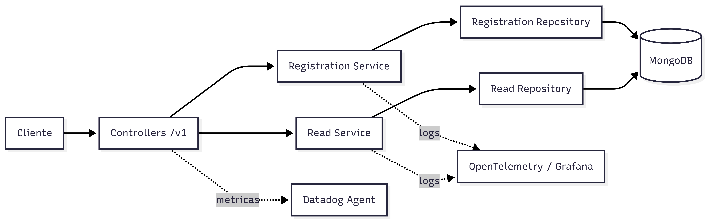

# user-api

Microservicio construido con `NestJS` para la gestion de usuarios de la plataforma. Se encarga de registrar usuarios, almacenar sus credenciales de forma segura y validar el acceso consultando la informacion persistida en `MongoDB`.

## Que hace este proyecto

- Registra usuarios con tipo y numero de documento.
- Almacena la contrasena de forma segura usando hash con `scrypt`.
- Consulta usuarios validando credenciales.
- Expone metricas con `Datadog` y logs con `OpenTelemetry`.

## Arquitectura

El proyecto sigue una arquitectura hexagonal por modulo, separando:

- `application`: casos de uso y servicios de negocio.
- `domain`: modelos y puertos.
- `infrastructure`: controladores, repositorios y esquemas.
- `commons`: componentes transversales como metricas y tracing.

Modulos principales:

- `registration`: registra usuarios en `MongoDB`.
- `read`: valida credenciales y consulta datos del usuario.

## Diagrama de arquitectura



## Endpoints principales

### `POST /v1/registration`

Registra un usuario nuevo.

Ejemplo de payload:

```json
{
  "documentType": "CC",
  "documentNumber": 1111,
  "username": "Jorge X",
  "password": "1111"
}
```

Tipos de documento soportados:

- `CC`
- `CE`
- `TI`

### `POST /v1/read`

Valida credenciales y consulta la informacion del usuario.

Ejemplo de payload:

```json
{
  "documentType": "CC",
  "documentNumber": 2123,
  "password": "2123"
}
```

## Ejemplos de consumo

Registrar un usuario:

```bash
curl --location 'http://localhost:3002/v1/registration' \
--header 'Content-Type: application/json' \
--data '{
    "documentType": "CC",
    "documentNumber": 1111,
    "username": "Jorge X",
    "password": "1111"
}'
```

Consultar usuario validando credenciales:

```bash
curl --location 'http://localhost:3002/v1/read' \
--header 'Content-Type: application/json' \
--data '{
    "documentType": "CC",
    "documentNumber": 2123,
    "password": "2123"
}'
```

## Persistencia e integraciones

- `MongoDB`: persistencia principal para usuarios y credenciales.
- `Datadog`: metricas via `hot-shots`.
- `Grafana / OpenTelemetry`: exportacion de logs y telemetria.

## Seguridad

- La contrasena no se almacena en texto plano.
- El registro aplica hash con `scrypt` y `salt`.
- La consulta de usuario valida la contrasena con comparacion segura.

## Estructura del codigo

```text
src/
  api/
    registration/
    read/
  commons/
    metrics.module.ts
    metrics.service.ts
    tracing.ts
  app.module.ts
  main.ts
```

## Ejecucion

Instalar dependencias:

```bash
npm install
```

Levantar en desarrollo:

```bash
npm run start:dev
```

Compilar:

```bash
npm run build
```

## Testing

- `npm test`: pruebas unitarias.
- `npm run test:e2e`: pruebas end-to-end.
- `npm run test:cov`: cobertura.

## Observabilidad

El servicio inicializa `OpenTelemetry` desde `src/main.ts` e importa `src/commons/tracing.ts`. Adicionalmente, publica metricas por `StatsD` usando `DD_AGENT_HOST` como destino para el agente de `Datadog`.
